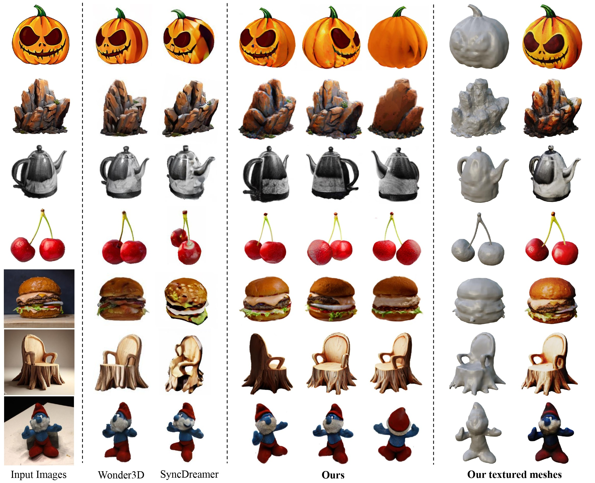
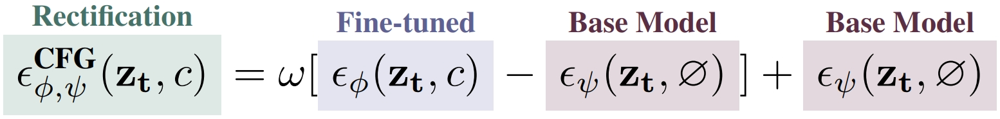
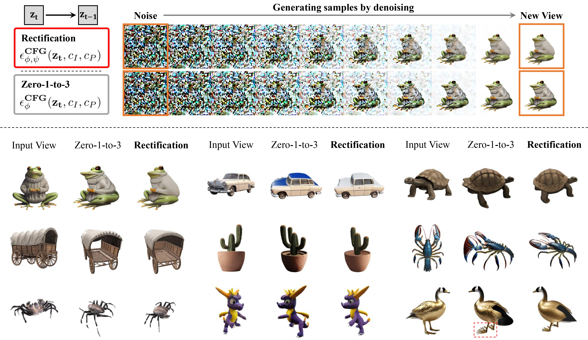
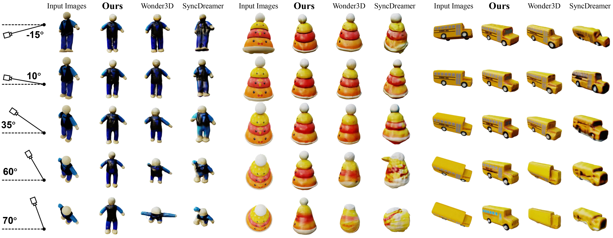
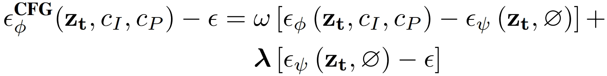

# USD: Optimized View and Geometry Distillation from Multi-view Diffuser
## [Project page](https://youjiazhang.github.io/USD/) | [Paper](https://arxiv.org/pdf/2312.06198.pdf)

> [Optimized View and Geometry Distillation from Multi-view Diffuser](https://arxiv.org/pdf/2312.06198)  
> Youjia Zhang, Zikai Song, Junqing Yu, Yawei Luo, Wei Yang.  
> IJCAI 2025

<div align=center>
  
</div>

Our technique produces multi-view images and geometries that are comparable, sometimes superior particularly for irregular camera poses, when benchmarked against concurrent methodologies such as [SyncDreamer](https://github.com/liuyuan-pal/SyncDreamer) and [Wonder3D](https://github.com/xxlong0/Wonder3D), without training on large-scale data. To reconstruct 3D geometry from the 2D representations, our method is built on the instant-NGP based SDF reconstruction [instant-nsr-pl](https://github.com/bennyguo/instant-nsr-pl).

## Unbiased Sampling of Multi-view Diffuser
Our proposed rectification method essentially combines the **[unconditional noise]** prediction from the base model and the **[conditional noise]** prediction from the fine-tuned model. This can be further interpreted through the formulation provided in **Appendix A**.

<div align=center>
  
  
</div>


## Different Viewing Angle Comparisons
<div align=center>
  
</div>

Concurrent methods, like [SyncDreamer](https://github.com/liuyuan-pal/SyncDreamer) and [Wonder3D](https://github.com/xxlong0/Wonder3D) impose limitations on the viewing angles of the input image.

## Unbiased Score Distillation
<div align=center>
  
</div>

Where setting **λ = 1**, we get Formula SDS. We observed that setting **λ = 0** can significantly improve the details of the 3D results generated using SDS.

### Image-to-3D
```
# USD image-to-3D 
python launch.py --config configs/usd-patch.yaml --train --gpu 0
```

### Text-to-3D

https://github.com/YoujiaZhang/USD/assets/43102378/45e07092-c62e-4236-a0fa-79238765648c

```
# --------- Stage 1 (NeRF, SDS guidance, lambda=0) --------- #
python launch.py --config configs/usd-text-to-3D-patch.yaml --train --gpu 0 system.prompt_processor.prompt="a pineapple"

# --------- Stage 2 (Geometry Refinement,  SDS guidanc) --------- #
# refine geometry with 512x512 rasterization
python launch.py --config configs/usd-text-to-3D-geometry.yaml --train --gpu 0 system.prompt_processor.prompt="a pineapple" system.geometry_convert_from=path/to/stage1/trial/dir/ckpts/last.ckpt

# --------- Stage 3 (Texturing, SDS guidance, lambda=0) --------- #
# texturing with 512x512 rasterization
python launch.py --config configs/usd-text-to-3D-texture.yaml --train --gpu 0 system.prompt_processor.prompt="a pineapple" system.geometry_convert_from=path/to/stage2/trial/dir/ckpts/last.ckpt
```

## Acknowledgement
We have intensively borrow codes from the following repositories. Many thanks to the authors for sharing their codes.
- [threestudio](https://github.com/threestudio-project/threestudio)
- [zero123](https://github.com/cvlab-columbia/zero123)
- [SyncDreamer](https://github.com/liuyuan-pal/SyncDreamer)
- [Wonder3D](https://github.com/xxlong0/Wonder3D/tree/main)
- [instant-nsr-pl](https://github.com/bennyguo/instant-nsr-pl)

## Citation
```
@article{zhang2023optimized,
  title={Optimized View and Geometry Distillation from Multi-view Diffuser},
  author={Zhang, Youjia and Yu, Junqing and Song, Zikai and Yang, Wei},
  journal={arXiv preprint arXiv:2312.06198},
  year={2023}
}
```
