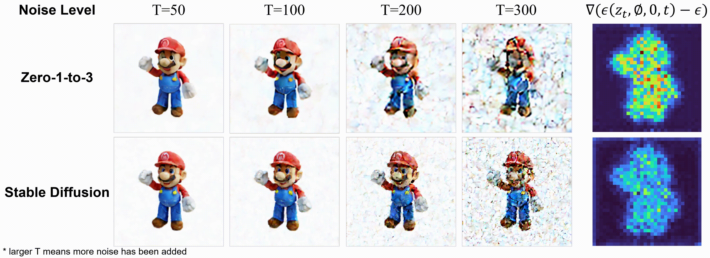

# USD
Optimized View and Geometry Distillation from Multi-view Diffuser
## [Paper](https://arxiv.org/pdf/2312.06198.pdf) | [Project page](https://youjiazhang.github.io/USD/)


<div align=center>
  
</div>

Our technique produces multi-view images and geometries that are comparable, sometimes superior particularly for irregular camera poses, when benchmarked against concurrent methodologies such as [SyncDreamer](https://github.com/liuyuan-pal/SyncDreamer) and [Wonder3D](https://github.com/xxlong0/Wonder3D), without training on large-scale data. To reconstruct 3D geometry from the 2D representations, our method is built on the instant-NGP based SDF reconstruction [instant-nsr-pl](https://github.com/bennyguo/instant-nsr-pl).

## Denoising with unconditional noise

<div align=center>
  
</div>

The unconditional noise predicted by Zero-1-to-3 model tends to be biased. The right subfigure shows the averaged difference between the predicted noise and the added noise. We take the unconditional noise predicted by Zero-1-to-3 to remove noise from the noisy input and recover the original image. We can see that even though a very low level of noise has been added, the denoised result deviates from the original image largely. In contrast, if we use the unconditional noise predicted by Stable Diffusion for denoising, only subtle details change while the main structure and identity of ‘Mario’ are preserved.

## Unbiased Score Distillation
<div align=center>
  
</div>

## Different Viewing Angle Comparisons
<div align=center>
  
</div>

Concurrent methods, like [SyncDreamer](https://github.com/liuyuan-pal/SyncDreamer) and [Wonder3D](https://github.com/xxlong0/Wonder3D) impose limitations on the viewing angles of the input image.

## Image-to-3D
```
# USD image-to-3D 
python launch.py --config configs/usd-patch.yaml --train --gpu 0
```

## Text-to-3D  SDS

https://github.com/YoujiaZhang/USD/assets/43102378/45e07092-c62e-4236-a0fa-79238765648c

```
# --------- Stage 1 (NeRF, SDS guidance, lambda=0) --------- #
python launch.py --config configs/usd-text-to-3D-patch.yaml --train --gpu 0 system.prompt_processor.prompt="a pineapple"

# --------- Stage 2 (Geometry Refinement,  SDS guidanc) --------- #
# refine geometry with 512x512 rasterization
python launch.py --config configs/usd-text-to-3D-geometry.yaml --train --gpu 0 system.prompt_processor.prompt="a pineapple" system.geometry_convert_from=path/to/stage1/trial/dir/ckpts/last.ckpt

# --------- Stage 3 (Texturing, SDS guidance, lambda=0) --------- #
# texturing with 512x512 rasterization
python launch.py --config configs/usd-text-to-3D-texture.yaml --train --gpu 0 system.prompt_processor.prompt="a pineapple" system.geometry_convert_from=path/to/stage2/trial/dir/ckpts/last.ckpt
```
## $\lambda$ analysis 
### We found that the smaller the $\lambda$, the richer the 3D details generated using SDS!


## Acknowledgement
We have intensively borrow codes from the following repositories. Many thanks to the authors for sharing their codes.
- [threestudio](https://github.com/threestudio-project/threestudio)
- [zero123](https://github.com/cvlab-columbia/zero123)
- [SyncDreamer](https://github.com/liuyuan-pal/SyncDreamer)
- [Wonder3D](https://github.com/xxlong0/Wonder3D/tree/main)
- [instant-nsr-pl](https://github.com/bennyguo/instant-nsr-pl)

## Citation
```
@article{zhang2023optimized,
  title={Optimized View and Geometry Distillation from Multi-view Diffuser},
  author={Zhang, Youjia and Yu, Junqing and Song, Zikai and Yang, Wei},
  journal={arXiv preprint arXiv:2312.06198},
  year={2023}
}
```
